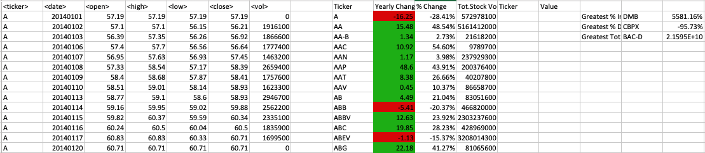
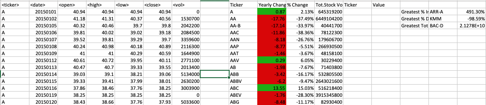
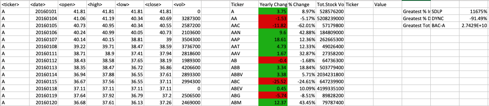

# The-VBA-of-Wall-Street

Create a script that will loop through all the stocks and take the following info.

Yearly change from what the stock opened the year at to what the closing price was.
The percent change from the what it opened the year at to what it closed.
The total Volume of the stock
Ticker symbol

You should also have conditional formatting that will highlight positive change in green and negative change in red.

Your solution will also be able to locate the stock with the "Greatest % increase", "Greatest % Decrease" and "Greatest total volume".

The result should look as follows:

2014:

2015:

2016:

